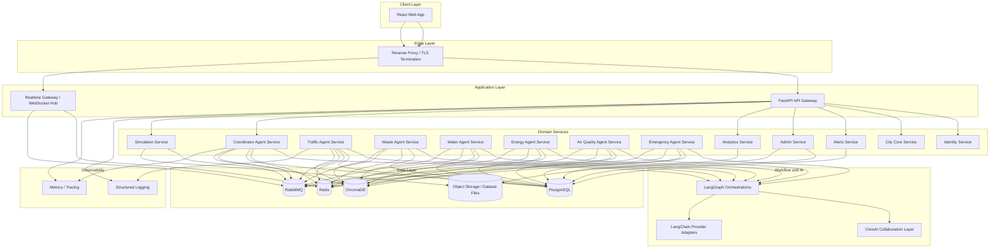

# High-Level Architecture

## Architectural Style

The platform follows:

- Clean Architecture for dependency direction
- Domain Driven Design for bounded contexts
- Event-driven microservices for agent autonomy
- Repository pattern and unit-of-work abstractions
- Dependency injection for infrastructure decoupling

## Bounded Contexts

- Identity and Access
- City Topology and Assets
- Traffic Operations
- Waste Operations
- Water Operations
- Energy Operations
- Air Quality Operations
- Emergency Operations
- Alerts and Notifications
- Agent Orchestration
- Decision Intelligence
- Analytics and Reporting
- Administration and Audit

## Deployment View



## Logical Layers Per Service

```text
Presentation
  FastAPI routers / WebSocket handlers / DTOs
Application
  Use cases / command handlers / query handlers / policies
Domain
  Entities / value objects / aggregates / domain services / repository contracts
Infrastructure
  SQLAlchemy repos / Redis cache / RabbitMQ bus / Chroma memory / LLM adapters
```

## Service Responsibilities

| Service | Responsibility |
| --- | --- |
| `api-gateway` | Unified external API surface, auth delegation, request composition |
| `realtime-gateway` | WebSocket subscriptions, operator presence, live feed broadcasting |
| `identity-service` | Users, roles, auth, tokens, API keys |
| `city-core-service` | Zones, districts, assets, sensors, map configuration |
| `simulation-service` | Synthetic data generation, seeded scenarios, replay engine |
| `traffic-agent-service` | Traffic telemetry analysis, congestion prediction, route recommendations |
| `waste-agent-service` | Bin overflow prediction, route scheduling, collection optimization |
| `water-agent-service` | Leak detection, pressure analysis, shortage forecasting |
| `energy-agent-service` | Load analysis, overload prediction, energy balancing recommendations |
| `air-agent-service` | AQI analysis, pollution forecasts, mitigation recommendations |
| `emergency-agent-service` | Incident routing, priority assignment, dispatch support |
| `coordinator-agent-service` | Cross-agent reasoning, city decision generation, explainability |
| `alerts-service` | Alert lifecycle, deduplication, escalation, notifications |
| `analytics-service` | Aggregates, KPIs, reports, chart-ready data |
| `admin-service` | Agent controls, dataset management, operational administration |

## Cross-Cutting Concerns

- Shared auth and policy enforcement
- Schema versioning for agent outputs
- Correlation IDs for requests and workflow runs
- Observability hooks on all commands and events
- Centralized configuration and secret injection
- Resilience patterns including circuit breakers, retries, and dead-letter queues

## Recommended Runtime Topology

- Frontend container served via NGINX
- Dedicated backend containers per service
- RabbitMQ and Redis as shared infrastructure
- PostgreSQL for transactional persistence
- ChromaDB for semantic memory
- Optional inference gateway for model routing

## Future Expansion

The design supports additional agents such as:

- Public transport optimization
- Disaster management
- Citizen service engagement
- Parking optimization
- Urban planning and zoning intelligence
