# Database ER Diagram

## Modeling Principles

- Normalized operational schema for transactional integrity
- Time-series friendly domain event tables for telemetry
- Separate audit and decision lineage records
- Extensible agent memory references and vector document links

## Core Entities

```mermaid
erDiagram
    USERS ||--o{ USER_ROLES : has
    ROLES ||--o{ USER_ROLES : maps
    USERS ||--o{ USER_SESSIONS : opens
    USERS ||--o{ API_KEYS : owns
    USERS ||--o{ NOTIFICATIONS : receives
    USERS ||--o{ AUDIT_LOGS : performs
    USERS ||--o{ AGENT_RUNS : triggers
    USERS ||--o{ DECISION_HISTORY : approves

    CITY_ZONES ||--o{ CITY_ASSETS : contains
    CITY_ZONES ||--o{ TRAFFIC_READINGS : scopes
    CITY_ZONES ||--o{ WASTE_BIN_READINGS : scopes
    CITY_ZONES ||--o{ WATER_READINGS : scopes
    CITY_ZONES ||--o{ ENERGY_READINGS : scopes
    CITY_ZONES ||--o{ AIR_QUALITY_READINGS : scopes
    CITY_ZONES ||--o{ EMERGENCIES : scopes
    CITY_ZONES ||--o{ ALERTS : scopes

    CITY_ASSETS ||--o{ SENSOR_DEVICES : hosts
    SENSOR_DEVICES ||--o{ TRAFFIC_READINGS : produces
    SENSOR_DEVICES ||--o{ WASTE_BIN_READINGS : produces
    SENSOR_DEVICES ||--o{ WATER_READINGS : produces
    SENSOR_DEVICES ||--o{ ENERGY_READINGS : produces
    SENSOR_DEVICES ||--o{ AIR_QUALITY_READINGS : produces

    TRAFFIC_INCIDENTS ||--o{ ALERTS : raises
    EMERGENCIES ||--o{ ALERTS : raises
    ALERTS ||--o{ ALERT_EVENTS : records
    ALERTS ||--o{ NOTIFICATIONS : dispatches

    AGENTS ||--o{ AGENT_TOOLS : owns
    AGENTS ||--o{ AGENT_RUNS : executes
    AGENT_RUNS ||--o{ AGENT_OUTPUTS : emits
    AGENT_RUNS ||--o{ AGENT_LOGS : records
    AGENT_RUNS ||--o{ AGENT_MEMORY_ITEMS : updates

    AGENT_OUTPUTS ||--o{ DECISION_INPUTS : informs
    AGENT_RUNS ||--o{ AGENT_COLLAB_MESSAGES : sends
    AGENTS ||--o{ AGENT_COLLAB_MESSAGES : participates

    DECISION_HISTORY ||--o{ DECISION_INPUTS : aggregates
    DECISION_HISTORY ||--o{ DECISION_ACTIONS : contains
    DECISION_HISTORY ||--o{ AUDIT_LOGS : traces

    DATASETS ||--o{ DATASET_VERSIONS : versions
    DATASET_VERSIONS ||--o{ INGESTION_JOBS : drives

    USERS {
      uuid id PK
      string email UK
      string password_hash
      string full_name
      string status
      timestamptz created_at
      timestamptz updated_at
    }
    ROLES {
      uuid id PK
      string name UK
      string description
    }
    USER_ROLES {
      uuid user_id FK
      uuid role_id FK
      timestamptz assigned_at
    }
    USER_SESSIONS {
      uuid id PK
      uuid user_id FK
      string refresh_token_hash
      string ip_address
      string user_agent
      timestamptz expires_at
    }
    API_KEYS {
      uuid id PK
      uuid user_id FK
      string key_prefix
      string key_hash
      string status
      timestamptz last_used_at
    }
    CITY_ZONES {
      uuid id PK
      string name
      string zone_type
      jsonb geometry
      integer priority
    }
    CITY_ASSETS {
      uuid id PK
      uuid zone_id FK
      string asset_type
      string name
      jsonb location
      string operational_status
    }
    SENSOR_DEVICES {
      uuid id PK
      uuid asset_id FK
      string sensor_type
      string external_ref
      string status
      timestamptz last_seen_at
    }
    TRAFFIC_READINGS {
      uuid id PK
      uuid zone_id FK
      uuid sensor_id FK
      decimal flow_rate
      decimal occupancy
      decimal avg_speed
      timestamptz observed_at
    }
    TRAFFIC_INCIDENTS {
      uuid id PK
      uuid zone_id FK
      string severity
      string incident_type
      jsonb location
      timestamptz started_at
      timestamptz resolved_at
    }
    WASTE_BIN_READINGS {
      uuid id PK
      uuid zone_id FK
      uuid sensor_id FK
      decimal fill_level_pct
      decimal temperature_c
      timestamptz observed_at
    }
    WATER_READINGS {
      uuid id PK
      uuid zone_id FK
      uuid sensor_id FK
      decimal pressure_bar
      decimal flow_lpm
      decimal reservoir_level_pct
      timestamptz observed_at
    }
    ENERGY_READINGS {
      uuid id PK
      uuid zone_id FK
      uuid sensor_id FK
      decimal load_mw
      decimal voltage_kv
      decimal frequency_hz
      timestamptz observed_at
    }
    AIR_QUALITY_READINGS {
      uuid id PK
      uuid zone_id FK
      uuid sensor_id FK
      integer aqi
      decimal pm25
      decimal pm10
      decimal no2
      timestamptz observed_at
    }
    EMERGENCIES {
      uuid id PK
      uuid zone_id FK
      string emergency_type
      string severity
      string status
      jsonb location
      timestamptz reported_at
    }
    ALERTS {
      uuid id PK
      uuid zone_id FK
      uuid source_record_id
      string source_type
      string severity
      string status
      string title
      text summary
      timestamptz created_at
    }
    ALERT_EVENTS {
      uuid id PK
      uuid alert_id FK
      string event_type
      uuid actor_user_id FK
      timestamptz created_at
    }
    NOTIFICATIONS {
      uuid id PK
      uuid user_id FK
      uuid alert_id FK
      string channel
      string status
      timestamptz sent_at
    }
    AGENTS {
      uuid id PK
      string name UK
      string agent_type
      string status
      jsonb config
    }
    AGENT_TOOLS {
      uuid id PK
      uuid agent_id FK
      string tool_name
      string tool_type
      jsonb config
    }
    AGENT_RUNS {
      uuid id PK
      uuid agent_id FK
      uuid triggered_by_user_id FK
      string correlation_id
      string run_status
      timestamptz started_at
      timestamptz completed_at
    }
    AGENT_OUTPUTS {
      uuid id PK
      uuid run_id FK
      string schema_version
      jsonb output_payload
      decimal confidence_score
      timestamptz created_at
    }
    AGENT_LOGS {
      uuid id PK
      uuid run_id FK
      string level
      text message
      jsonb metadata
      timestamptz created_at
    }
    AGENT_MEMORY_ITEMS {
      uuid id PK
      uuid run_id FK
      uuid agent_id FK
      string memory_scope
      string vector_document_ref
      jsonb memory_payload
      timestamptz created_at
    }
    AGENT_COLLAB_MESSAGES {
      uuid id PK
      uuid run_id FK
      uuid sender_agent_id FK
      uuid recipient_agent_id FK
      string message_type
      jsonb payload
      timestamptz created_at
    }
    DECISION_HISTORY {
      uuid id PK
      uuid approved_by_user_id FK
      string decision_type
      string severity
      jsonb rationale
      jsonb recommended_actions
      timestamptz created_at
    }
    DECISION_INPUTS {
      uuid id PK
      uuid decision_id FK
      uuid agent_output_id FK
      string input_role
    }
    DECISION_ACTIONS {
      uuid id PK
      uuid decision_id FK
      string action_type
      jsonb action_payload
      string execution_status
    }
    DATASETS {
      uuid id PK
      string name UK
      string domain
      string source_type
      string status
    }
    DATASET_VERSIONS {
      uuid id PK
      uuid dataset_id FK
      string version_label
      string storage_uri
      timestamptz created_at
    }
    INGESTION_JOBS {
      uuid id PK
      uuid dataset_version_id FK
      string job_status
      integer records_processed
      timestamptz started_at
      timestamptz completed_at
    }
    AUDIT_LOGS {
      uuid id PK
      uuid actor_user_id FK
      string entity_type
      uuid entity_id
      string action
      jsonb before_state
      jsonb after_state
      timestamptz created_at
    }
```

## Database Notes

- `source_record_id` is polymorphic and paired with `source_type`.
- High-volume telemetry tables should be partitioned by time in production.
- Geospatial fields should use PostGIS types when implementation begins.
- Aggregated analytics can be materialized separately from operational tables.
