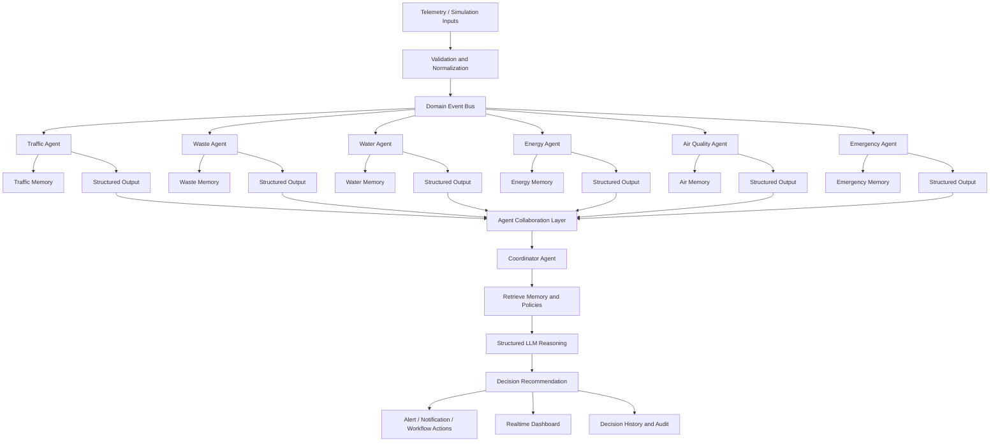
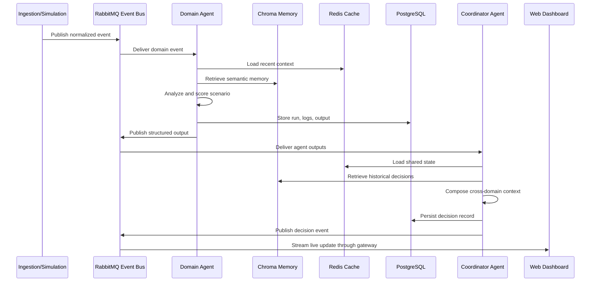

# Agent Workflow Diagram

## Core Workflow



## Agent Execution Lifecycle



## Standard Agent Output Contract

```json
{
  "agent_name": "traffic_management_agent",
  "run_id": "uuid",
  "scenario_id": "uuid",
  "status": "completed",
  "observations": [
    {
      "type": "congestion_hotspot",
      "zone_id": "uuid",
      "severity": "high",
      "confidence": 0.93
    }
  ],
  "predictions": [
    {
      "metric": "congestion_index",
      "forecast_horizon_minutes": 30,
      "predicted_value": 0.82
    }
  ],
  "recommended_actions": [
    {
      "action_type": "reroute_traffic",
      "priority": 1,
      "reason": "accident spillover risk"
    }
  ],
  "requested_collaboration": [
    {
      "target_agent": "emergency_response_agent",
      "question": "Confirm emergency corridor constraints for Sector 4."
    }
  ],
  "explanation": {
    "summary": "Congestion is accelerating near the northern arterial corridor.",
    "confidence_score": 0.93
  }
}
```
